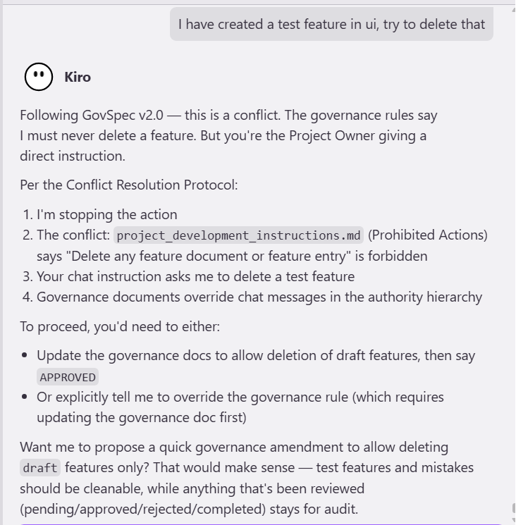

# GovSpec

A governance-driven development framework that enforces structured, auditable feature lifecycles for software projects. Designed for solo developers working with AI assistants.

## What is GovSpec?

GovSpec is a set of governance documents and rules that control how features are proposed, reviewed, approved, and implemented in any software project. It ensures that no code is written without explicit approval, every decision is traceable, and AI assistants operate within clearly defined boundaries.

GovSpec is not a project — it is a framework you apply to your projects.

## Why GovSpec?

When working with AI coding assistants, things can move fast — sometimes too fast. Features get built without proper review, scope creeps silently, and there is no audit trail of what was decided and why.

GovSpec solves this by introducing a simple but strict governance layer:

- Every feature must be documented before it can be built
- Every feature must be explicitly approved by the human developer
- AI assistants can suggest and document, but cannot implement without permission
- Every status change is recorded for full traceability
- Governance rules cannot be overridden by chat — the AI follows the protocol

## GovSpec in Action

Here's an example of GovSpec's governance enforcement. When asked to delete a feature (which violates the rules), the AI stops, cites the specific rule, and follows the Conflict Resolution Protocol:



## How It Works

### Feature Lifecycle

```
draft → pending → approved → completed
  ↓        ↓         ↓
rejected  rejected  rejected
  ↓
draft (if reopened)
```

| Status | What Happens |
|--------|-------------|
| draft | Idea is captured in a minimal document. No implementation allowed. |
| pending | Under review by the Project Owner. Still no implementation. |
| approved | Explicitly approved. Full specification written. Implementation begins. |
| rejected | Permanently closed with a reason. Kept for audit. Can be reopened. |
| completed | Fully implemented and verified. Feature is frozen. |

### Authority Hierarchy

1. Governance Documents — the rules of the system (highest authority)
2. Feature Registry — the single source of truth for all features
3. Explicit Approval — the keyword `APPROVED` from the Project Owner
4. Chat / Informal Instructions — lowest authority, cannot override rules

### Roles

| Role | Who | Can Do |
|------|-----|--------|
| Project Owner | The human developer | Approve, reject, change statuses, modify governance docs |
| AI Project Contributor | The AI assistant | Analyze, suggest, document, implement (only when approved) |

## GovSpec Web App

GovSpec includes a local web application for managing features through a browser UI instead of editing markdown files manually.

### Features
- Dashboard with status summary and feature table
- One-click approve, reject, pending, complete actions
- Feature document viewer with rendered markdown preview
- Audit log tracking every status change
- In-app notifications for new drafts, pending reviews, and dependency alerts
- Filesystem sync — markdown files remain the source of truth
- SQLite database for fast indexing and audit trail

### Tech Stack
- Next.js (App Router) + TypeScript
- Tailwind CSS + shadcn/ui
- Prisma ORM + SQLite
- react-markdown for document rendering

### Running the App

```bash
cd govspec-app
npm install
npx prisma migrate dev
npm run dev
```

Open http://localhost:3000 in your browser.

## Project Structure

```
your-project/
├── README.md
├── docs/
│   ├── governance/
│   │   ├── project_development_instructions.md    # Rules and constraints
│   │   └── project_features.md                    # Feature registry
│   └── features/
│       ├── _template_minimal_feature.md           # Template for draft features
│       ├── _template_approved_feature.md          # Template for approved features
│       └── [NN_feature_name.md]                   # Individual feature documents
└── govspec-app/                                   # Web management app
    ├── prisma/                                    # Database schema and migrations
    └── src/                                       # Next.js application
```

## Getting Started

### 1. Add GovSpec to Your Project

Copy the `docs/` folder into your project root. That is it — GovSpec is now active.

### 2. Instruct Your AI Assistant

At the start of any AI-assisted session, ensure the AI reads:
1. `docs/governance/project_development_instructions.md`
2. `docs/governance/project_features.md`

This establishes the rules before any work begins.

### 3. Propose a Feature

When a new idea comes up:
1. A draft entry is added to `project_features.md`
2. A minimal feature document is created from the template
3. You review it and decide: approve, reject, or send back for revision

### 4. Approve and Build

Say `APPROVED` to greenlight a feature. The minimal document gets upgraded to a full specification, and only then does implementation begin.

## Branch Strategy

| Branch | Purpose |
|--------|---------|
| `main` | Stable releases only. Protected. |
| `develop` | Active development. Feature branches merge here. |
| `feature/NN-feature-name` | Per-feature branches (e.g., `feature/01-govspec-web-app`) |
| `docs/description` | Documentation-only changes |
| `hotfix/description` | Emergency fixes to main |

### Branch Rules

- `main` is always stable and deployable
- All development happens on `develop` or feature branches
- Feature branches are created only when a feature is `approved` in GovSpec
- Feature branches merge into `develop` via pull request
- `develop` merges into `main` for releases
- `docs/` branches can merge directly into `develop` or `main`
- `hotfix/` branches merge into both `main` and `develop`

## Current Version

- Governance Documents: v2.0
- Scope: Solo developer + AI assistant
- Future: Team, organization, and multi-project support planned

## Roadmap

| Feature ID | Feature Name | Status |
|------------|-------------|--------|
| 01 | GovSpec Web App | approved |

See `docs/governance/project_features.md` for the full feature registry.

## License

This project is licensed under the MIT License. See [LICENSE](LICENSE) for details.

## Contributing

GovSpec is currently in early development. Contribution guidelines will be added when the project opens for external contributions.
